# Amazon ML Challenge 2026: Business Entity Resolution
## Comprehensive Dataset, System Architecture & Pipeline Flow Guide

**Team:** DataResolvers  
**Task:** Business Entity Resolution  
**Target Metric:** Macro-averaged Per-Entity $F_{0.5}$ (Precision weighted 2× over recall; singletons scored 1.0 / 0.0)  
**Achieved Validation Score:** **0.98006 (98.01%)** | **5-Fold CV Mean:** **0.97342 $\pm$ 0.00409**

---

## Table of Contents
1. [Dataset Deep Dive](#1-dataset-deep-dive)
   - [What is Business Entity Resolution?](#what-is-business-entity-resolution)
   - [The Three Data Sources & Schema](#the-three-data-sources--schema)
   - [Dataset Volume & Scale](#dataset-volume--scale)
   - [Structural Rules & Physical Domain Constraints](#structural-rules--physical-domain-constraints)
   - [Real-World Noise Archetypes Cataloged](#real-world-noise-archetypes-cataloged)
2. [High-Level System Architecture](#2-high-level-system-architecture)
   - [The 6 Competitive Development Pillars](#the-6-competitive-development-pillars)
   - [Tri-Model GBDT Ensemble Strategy](#tri-model-gbdt-ensemble-strategy)
   - [Parameter & Licensing Compliance (<= 8B Limit)](#parameter--licensing-compliance--8b-limit)
3. [End-to-End Pipeline Flow](#3-end-to-end-pipeline-flow)
   - [Flowchart Diagram](#flowchart-diagram)
   - [Stage 1: Ingestion & Leakage-Free Splitting (`data.py`)](#stage-1-ingestion--leakage-free-splitting-datapy)
   - [Stage 2: Normalization & Multi-Script Preprocessing (`normalize.py`)](#stage-2-normalization--multi-script-preprocessing-normalizepy)
   - [Stage 3: Multi-Strategy Blocking & TF-IDF Ranking (`blocking.py`)](#stage-3-multi-strategy-blocking--tf-idf-ranking-blockingpy)
   - [Stage 4: Deterministic 55-Dimensional Feature Extraction (`features.py`)](#stage-4-deterministic-55-dimensional-feature-extraction-featurespy)
   - [Stage 5: Multi-Model Training & 5-Fold GroupKFold (`model.py`)](#stage-5-multi-model-training--5-fold-groupkfold-modelpy)
   - [Stage 6: Decision Threshold Optimization (`evaluate.py`)](#stage-6-decision-threshold-optimization-evaluatepy)
   - [Stage 7: Global Consistency Post-Processing (`consistency.py`)](#stage-7-global-consistency-post-processing-consistencypy)
   - [Stage 8: Output Generation & Submission Validation (`pipeline.py`)](#stage-8-output-generation--submission-validation-pipelinepy)
4. [Empirical Evaluation & Experiment Scoreboard](#4-empirical-evaluation--experiment-scoreboard)
5. [Reproduction & CLI Usage Guide](#5-reproduction--cli-usage-guide)

---

## 1. Dataset Deep Dive

### What is Business Entity Resolution?
In enterprise data ecosystems (e-commerce catalogs, commercial registries, supply chains), records about the same physical business arrive from disparate sources (web crawls, user registrations, public tax records, invoices). Because these records contain spelling errors, corporate abbreviations, transliterations across multiple writing scripts, and truncated addresses, they cannot be joined using standard database foreign keys.

**The Task:** For every clean reference business record in **Source 1**, identify all corresponding noisy entity fragments residing in **Source 2** and **Source 3** that refer to the exact same physical commercial entity.

```text
[Source 1: Canonical Reference Catalog]
      │
      ├──> S1-71575516 ("Weldon Beacon Hall Inc", "1524 Destiny Drive, Murfreesboro, TN", US)
      │       │
      │       ├── Matches S2-5723968 ("WELDON BEACON [HALL]", "TN, 1524 DESTINY DR, MURFREESBOO", US)
      │       ├── Matches S3-730865871 ("Weldon Beacon", "1524 Destiny Drive, Murfreesboo, Tennessee", US)
      │       └── Matches S3-991444605 ("Weldon Beacon Hall Inc Inc", "1524 Destiny Dr, Murfreesboo, TN", US)
```

### Official Dataset Download & Mirror
- **Google Drive Dataset Mirror:** [Download Amazon ML Challenge 2026 Dataset (Google Drive)](https://drive.google.com/drive/folders/1L21j0i0xjc14bRVLgL0Be40Ijz1_MiQv?usp=sharing)
- **Folder Contents:** Contains all training and test TSVs (`train_source1.tsv`, `train_source2.tsv`, `train_source3.tsv`, `train_ground_truth.tsv`, `test_source1.tsv`, `test_source2.tsv`, `test_source3.tsv`).

---

### The Three Data Sources & Schema
Every source file in both `train/` and `test/` is formatted as a strict, tab-separated values (`.tsv`) file with the following schema:


| Column Name | Data Type | Description | Representative Example |
| :--- | :--- | :--- | :--- |
| `entity_id` | String | Unique identifier prefixed by source origin (`S1-...`, `S2-...`, `S3-...`) | `S1-714132312` |
| `business_name` | String | Commercial, brand, or registered business title | `Zephay Labs Inc` |
| `business_address`| String | Physical geographic address | `2621 Cotten Road, Tyler, TX 75701` |
| `country` | String | Open-string country indicator | `US`, `India`, `France` |

* **Source 1 (`train_source1.tsv`, `test_source1.tsv`):** The clean, deduplicated reference table. Every row represents an authoritative, distinct real-world entity.
* **Source 2 (`train_source2.tsv`, `test_source2.tsv`):** Web-scraped and commercial directory fragments with typical web OCR noise, casing anomalies, and corporate suffixes.
* **Source 3 (`train_source3.tsv`, `test_source3.tsv`):** Transactional and localized records frequently containing non-Latin scripts (Devanagari, Tamil) and informal landmark-based addresses.
* **Ground Truth (`train_ground_truth.tsv`):** Two tab-separated columns:
  * `source1_entity_id`: Reference entity ID.
  * `matched_entity_ids`: Comma-separated list of true matching IDs from S2 and S3 (e.g. `S2-5723968,S3-730865871`), or an **empty string** for singletons.

---

### Dataset Volume & Scale

| Dataset Split | Source 1 Entities | Source 2 Records | Source 3 Records | Full Cartesian Product Space |
| :--- | :--- | :--- | :--- | :--- |
| **Training Split** | **2,206,821** | ~5,000,000 | ~5,000,000 | $\approx 2.2 \times 10^{13}$ (22 Trillion comparisons) |
| **Official Test Split** | **1,732,544** | ~4,887,273 | ~5,080,000 | $\approx 1.7 \times 10^{13}$ (17.2 Trillion comparisons) |

Because computing pairwise machine learning features over 17 trillion pairs is computationally intractable, an ultra-fast, high-recall **candidate blocking engine** is mandatory to reduce the search space by $>99.93\%$ before classifier inference.

---

### Structural Rules & Physical Domain Constraints

#### 1. Singleton Dominance & Evaluation Dynamics (5.58%)
* Exactly **123,247 out of 2,206,821** (5.58%) Source 1 entities have **zero** matching fragments in Source 2 or Source 3.
* Under the competition's macro-averaged per-entity $F_{0.5}$ metric:
  * Predicting an empty match string `""` for a true singleton scores **1.0**.
  * Predicting even a single false match for a true singleton scores **0.0**.
  * Missing all matches for a non-singleton scores **0.0**.
* A trivial baseline predicting all entities as singletons scores **0.05585**. High-precision thresholding is rewarded because precision is weighted 2× over recall ($\beta = 0.5$).

#### 2. Physical Cardinality Law (1-to-at-most-1)
* In the physical world, an individual commercial store or office branch represented by an S2 or S3 fragment belongs to at most one reference entity.
* Across all 336,135 ground truth pairs checked, **0.00%** of Source 2 or Source 3 records are associated with multiple Source 1 entities.
* The pipeline exploits this through **Stage 7 Global Consistency post-processing**, which resolves any multi-entity collision by assigning the fragment exclusively to its single highest-probability match.

#### 3. Open-String Country Boundary Rule & "Unseen France"
* Matches never cross country borders (0 / 336,135 ground truth matches crossed countries).
* **Train Split:** Contains only `US` (59.98%) and `India` (40.02%).
* **Test Split:** Introduces **`France`** (14.98%, ~259,000 S1 entities and ~1.4M S2/S3 fragments).
* Hardcoding country logic or categorical encoders fails on France. The pipeline dynamically discovers countries as open strings, normalizes French corporate suffixes (`SARL`, `SAS`, `EURL`, `SCI`), and handles French diacritics.

---

### Real-World Noise Archetypes Cataloged

| # | Noise Archetype | Source 1 Example | Source 2/3 Target Example | Pipeline Resolution Strategy |
| :---: | :--- | :--- | :--- | :--- |
| **1** | **Legal Suffix Variations** | `Om Constructions Pvt Ltd` | `Om Constructions Private Limited` | Multilingual legal suffix mapping table strips and normalizes 40+ corporate tags across English, French, and Hindi. |
| **2** | **Multi-Script Transliteration** | `Shree Ganesh Traders` | `श्री गणेश ट्रेडर्स` (Devanagari) | `anyascii` Latin transliteration converts non-Latin scripts to phonetic ASCII, enabling cross-script token matching. |
| **3** | **Token Transposition / Word Reorder** | `Tiena L. Hamilton, DDS` | `dds l. hamilton, tiena` | Word-order-invariant token sort and token set ratios (`rapidfuzz.fuzz.token_sort_ratio`). |
| **4** | **Informal Landmarks** | `Plot 42, GIDC Estate` | `Opp Bharata Mata College, Plot 42` | Regex landmark extraction captures phrases following `near`, `opp`, `behind`, isolating core street numbers. |
| **5** | **OCR & Typographical Noise** | `Machinists Local 579` | `Machinists Lofcl 579` | Distinctive name digit indexing (`579`) and character 2-gram/3-gram Jaccard distances recover character mutations. |
| **6** | **Multi-Tenant False Positives** | `Apex Solutions` (Suite 400) | `Apex Logistics` (Suite 400) | First-token brand extraction, root name ratio, and weakest-link interaction features prevent false merges at shared addresses. |

---

## 2. High-Level System Architecture

The pipeline implements the **6 competitive development pillars** recommended for entity resolution:

```text
 1. Proper Data Split     ───> Leakage-free stratified train/val split respecting test structure
 2. Feature Engineering   ───> 55 deterministic signals (Jaro-Winkler, Brand first-token, Digits, Subfields)
 3. Imbalance Handling    ───> Calibrated square-root ratio scale weighting (scale_pos_weight = 3.13)
 4. Cross-Validation      ───> 5-Fold GroupKFold strictly grouped by Source 1 entity ID
 5. Experiment Tracking   ───> Automated CSV spreadsheet (experiments/experiment_tracker.csv) & JSON log
 6. Multi-Model Ensemble  ───> XGBoost (40%) + LightGBM (35%) + CatBoost (25%) + Global Consistency
```

---

### Tri-Model GBDT Ensemble Strategy
To maximize model diversity and capture non-linear feature interactions, the pipeline combines three genuinely distinct tree-growing algorithms:

| Model Architecture | License | Tree-Growing Strategy | Key Strengths in Entity Resolution |
| :--- | :--- | :--- | :--- |
| **XGBoost (v3.4.1)** | **Apache-2.0** | Depth-wise histogram splitting | Fast parallel split finding, robust $L_1/L_2$ regularization on leaf weights. |
| **LightGBM (v4.7.0)** | **MIT** | Leaf-wise / best-first (GOSS) | Asymmetric leaf splits find deep multi-subfield interactions (e.g. name match $\land$ street match). |
| **CatBoost (v1.2.10)** | **Apache-2.0** | Oblivious / symmetric decision trees | Symmetric tree structure acts as a strong regularizer against tabular noise and overfitting. |

**Ensemble Probability Blending:**
$$P_{\text{ensemble}} = 0.40 \cdot P_{\text{XGBoost}} + 0.35 \cdot P_{\text{LightGBM}} + 0.25 \cdot P_{\text{CatBoost}}$$

---

### Parameter & Licensing Compliance (<= 8B Limit)
The competition requires all models to use permissive open-source licenses and have parameter counts $\le 8\text{ Billion}$.

| Component | Framework | License | Parameter Count | Constraint Status |
| :--- | :--- | :--- | :--- | :--- |
| Depth-wise GBDT | `xgboost` (v3.4.1) | **Apache-2.0** | ~3,500 tree nodes ($< 0.000005\text{B}$) | Compliant |
| Leaf-wise GBDT | `lightgbm` (v4.7.0) | **MIT** | ~3,100 tree nodes ($< 0.000005\text{B}$) | Compliant |
| Oblivious GBDT | `catboost` (v1.2.10) | **Apache-2.0** | ~3,840 tree nodes ($< 0.000005\text{B}$) | Compliant |
| String Distance C++ | `rapidfuzz` (v3.14.6) | **MIT** | 0 (algorithmic / non-parametric) | Compliant |
| Fast Data Processing | `polars` (v1.44.2) | **MIT** | 0 (algorithmic) | Compliant |
| **Total Pipeline** | — | **Apache-2.0 / MIT** | **~10,440 nodes ($\ll 8\text{B}$ limit)** | **100% Compliant** |

---

## 3. End-to-End Pipeline Flow

### Flowchart Diagram

```mermaid
flowchart TD
    subgraph DataPrep["Phase 1: Ingestion, Splitting & Normalization"]
        raw["Raw Files: S1, S2, S3 TSVs"] --> split["data.py: create_official_split()"]
        split --> train_split["Train S1 (80%)<br/>Preserving 5.58% Singletons"]
        split --> val_split["Val S1 (20%)<br/>Independent Pool + Distractors"]
        train_split & val_split --> norm["normalize.py: Record (__slots__)<br/>Unicode, Legal Suffixes, anyascii, Address Split"]
    end

    subgraph CandidateGen["Phase 2: Multi-Strategy Blocking & Ranking"]
        norm --> block["blocking.py: CountryCandidateIndex"]
        block --> c_part["Open-String Country Partition (US, India, France)"]
        c_part --> idx["7 Inverted Indices:<br/>1. Distinctive Name Tokens<br/>2. Transliterated ASCII Tokens<br/>3. Distinctive Name Digits<br/>4. Street No. + Street Prefix<br/>5. Postal Code + Street No.<br/>6. Address Rare Word Pairs<br/>7. Name Prefix + Locality Prefix"]
        idx --> tfidf["TF-IDF Multi-Strategy Ranking:<br/>Score = SUM(Weight / (Freq + 1))"]
        tfidf --> cands["Top-25 Highest-Confidence Candidates<br/>(96.01% - 98.8% True Match Recall)"]
    end

    subgraph FeatEng["Phase 3: 55-Dimensional Feature Engineering"]
        cands --> feat["features.py: compute_pair_features()"]
        feat --> fvec["55 Deterministic Signals:<br/>• Name: Jaro-Winkler, Levenshtein, Token Sort/Set<br/>• Brand: First-token exact, ratio, Jaro-Winkler<br/>• Digits: Number match/mismatch in name<br/>• Address: Token set, word Jaccard, char 2-grams<br/>• Structured: Postal exact/mismatch, prefix-3, street log-diff<br/>• Composites: Harmonic mean, Weakest-link min, Product"]
    end

    subgraph Modeling["Phase 4: Tri-Model GBDT Ensemble & CV"]
        fvec --> gkf["model.py: 5-Fold GroupKFold CV<br/>(Grouped strictly by Source 1 entity ID)"]
        gkf --> scale["Calibrated Imbalance Weighting:<br/>scale_pos_weight = 3.13"]
        scale --> xgb["XGBoost (40%)"]
        scale --> lgb["LightGBM (35%)"]
        scale --> cat["CatBoost (25%)"]
        xgb & lgb & cat --> blend["Weighted Probability Blending<br/>(5-Fold Mean Macro F0.5 = 0.97342)"]
    end

    subgraph PostProc["Phase 5: Threshold Optimization & Consistency"]
        blend --> sweep["evaluate.py: Threshold Sweeping<br/>tau* = 0.830 on complete OOF predictions"]
        sweep --> gc["consistency.py: Stage 7 Global Consistency<br/>Resolves 1-to-many conflicts: S2/S3 assigned to highest S1"]
    end

    subgraph Output["Phase 6: Submission & Audit"]
        gc --> out1["output/matching_results.tsv (Leaderboard Scored)"]
        gc --> out2["output/candidate_pairs.tsv (Candidate Set)"]
        out1 & out2 --> val_check["validate_submission.py (Official Format Check)"]
        val_check --> tracker["tracker.py: experiments/experiment_tracker.csv"]
    end
```



---

### Stage 1: Ingestion & Leakage-Free Splitting ([`data.py`](file:///f:/AmazonML/code/business_entity_resolution/src/data.py))
* Uses [`load_ground_truth()`](file:///f:/AmazonML/code/business_entity_resolution/src/data.py) to parse true matches and explicitly identify singletons (`len(matches) == 0`).
* [`create_official_split()`](file:///f:/AmazonML/code/business_entity_resolution/src/data.py) partitions the training dataset into Train and Validation sets:
  * **Singleton Stratification:** Preserves the true ~5.58% singleton ratio across both splits.
  * **Country Stratification:** Preserves national ratios (US ~60%, India ~40%).
  * **Zero Leakage:** S1 entities in Validation never appear in Train.
  * **Realistic Candidate Pool:** Populates the validation candidate pool with true matches plus independent background distractors from S2 and S3, accurately reflecting test-time search conditions.

---

### Stage 2: Normalization & Multi-Script Preprocessing ([`normalize.py`](file:///f:/AmazonML/code/business_entity_resolution/src/normalize.py))
Transforms raw, noisy strings into standardized records:
1. **Unicode NFKD & Diacritic Stripping:** Converts accented characters to root forms (`société` $\to$ `societe`, `àmicale` $\to$ `amicale`).
2. **Multilingual Legal Suffix Mapping:** Strips and maps 40+ corporate suffixes across English, French, and Indic languages (`pvt ltd`, `private limited`, `llc`, `corp`, `sarl`, `sas`, `प्रा. लि.` $\to$ canonical tags).
3. **Phonetic Latin Transliteration:** Uses `anyascii` to transliterate non-Latin scripts (Devanagari, Tamil, Gujarati) into phonetic Latin text, allowing cross-script name comparison.
4. **Structured Field Decomposition:** Regex extraction parses:
   * Postal/PIN codes (5–6 digits).
   * Street/building numbers (extracting numeric cores from `H.No 12/B`, `Plot 42`, `#1524`).
   * Landmark prepositions (`Near`, `Opp`, `Behind`).
5. **Memory-Safe Record Object:** Uses a Python [`Record`](file:///f:/AmazonML/code/business_entity_resolution/src/normalize.py) class with `__slots__` consuming ~120 bytes (a 75% RAM reduction compared to Python dicts).

---

### Stage 3: Multi-Strategy Blocking & TF-IDF Ranking ([`blocking.py`](file:///f:/AmazonML/code/business_entity_resolution/src/blocking.py))
Reduces the trillions of possible pairs down to a high-precision candidate set:
* **Country Partitioning:** Entities are indexed strictly within their country string.
* **7 Independent Inverted Indices:**
  1. `idx_name_token`: Root name tokens (length $\ge 3$, common stopwords removed).
  2. `idx_ascii_token`: Transliterated ASCII tokens (bridges Indic-Latin records).
  3. `idx_name_digits`: Distinctive digits from the name (e.g. `579` in "Local 579", `101` in "Hwy 101").
  4. `idx_addr_num_word`: Street number + 4-letter prefix of the first street word.
  5. `idx_postal_num`: Exact postal code + street number (anchors physical location).
  6. `idx_addr_pair`: Co-occurring pairs of rare locality tokens.
  7. `idx_prefix`: First 4 letters of name + first 3 letters of address.
* **TF-IDF Multi-Strategy Ranking:**
  When querying candidates for an S1 entity, each candidate receives an inverse-frequency score:
  $$\text{Score}(\text{candidate}) = \sum_{\text{strategy } s} \frac{\text{Weight}_s}{\text{Token Frequency in Index} + 1.0}$$
  Candidates sharing rare tokens or matching across multiple strategies receive top ranks. Truncating to the top 25 candidates yields **96.01% – 98.8% Candidate Recall**.

---

### Stage 4: Deterministic 55-Dimensional Feature Extraction ([`features.py`](file:///f:/AmazonML/code/business_entity_resolution/src/features.py))
For each candidate pair, [`compute_pair_features()`](file:///f:/AmazonML/code/business_entity_resolution/src/features.py) calculates 55 deterministic, country-agnostic signals:

```text
1-7:   Name Similarities (Levenshtein, partial, token sort, token set, Jaro-Winkler, root ratio, root Jaro-Winkler)
8-10:  ASCII Transliteration Similarities (ASCII sort ratio, ASCII root sort, ASCII root exact match)
11-13: Brand First-Token Signals (first token exact match, fuzzy ratio, Jaro-Winkler)
14-15: Token Inclusion Ratios (name token overlap coefficient, word Jaccard)
16-17: Fine-grained Character Overlap (character 2-gram Jaccard, 3-gram Jaccard)
18-22: Name Structure Flags (exact match, root exact match, prefix-3 match, length diff, length ratio)
23-25: Name Digit Alignment (digits exact match, digits mismatch, signed match flag: +1 / -1 / 0)
26-27: Legal Suffix Agreement (both have suffix, suffix exact match)
28-32: Address Similarities (Levenshtein, partial, token sort, token set, address Jaro-Winkler)
33-37: Address Overlap (word Jaccard, token overlap coefficient, 2-gram Jaccard, 3-gram Jaccard, length diff)
38-42: Postal Code Agreement (exact match, mismatch, signed flag, prefix-3 metro match, prefix-2 region match)
43-46: Street Number Alignment (exact match, mismatch, signed flag, logarithmic numeric difference)
47-48: Contextual Inclusion (landmark match flag, website/domain string containment)
49-55: Composite Interactions (harmonic mean, weakest-link min, product, abs diff, max name sim, composite score, high both sim)
```

Extraction is vectorized in C++ via RapidFuzz, processing over **11,800 candidate pairs per second**.

---

### Stage 5: Multi-Model Training & 5-Fold GroupKFold ([`model.py`](file:///f:/AmazonML/code/business_entity_resolution/src/model.py))
* **5-Fold `GroupKFold`:** Groups training candidate pairs by `source1_entity_id`. All candidates for a given S1 entity remain in the same fold, ensuring out-of-fold metrics measure generalization to unseen entities.
* **Calibrated Imbalance Weighting:**
  $$\text{scale\_pos\_weight} = \min(12.0, \max(2.0, 1.5 \times \sqrt{N_{\text{neg}} / N_{\text{pos}}})) \approx 3.13$$
  Prevents extreme probability saturation near 1.0, preserving a smooth sigmoid curve for threshold optimization.
* **Tri-Model Training:** Trains XGBoost, LightGBM, and CatBoost across all 5 folds, blending predictions with weights $(0.40, 0.35, 0.25)$.
* **Model Serialization:** Saves model binaries (`.json`, `.txt`, `.cbm`) and metadata (`_metadata.json`) containing licenses, parameter counts, and feature importances.

---

### Stage 6: Decision Threshold Optimization ([`evaluate.py`](file:///f:/AmazonML/code/business_entity_resolution/src/evaluate.py))
* Implements the exact competition metric:
  $$F_{0.5} = \frac{1.25 \times \text{Precision} \times \text{Recall}}{0.25 \times \text{Precision} + \text{Recall}}$$
* Performs a linear grid sweep over out-of-fold predicted probabilities to find the threshold $\tau^*$ that maximizes the global macro $F_{0.5}$.
* Optimal threshold: **$\tau^* = 0.830$**.
* Candidates scoring $< \tau^*$ are dropped; entities with no surviving candidates are predicted as empty singletons.

---

### Stage 7: Global Consistency Post-Processing ([`consistency.py`](file:///f:/AmazonML/code/business_entity_resolution/src/consistency.py))
* Enforces the physical 1-to-at-most-1 cardinality constraint.
* If a candidate S2 or S3 entity is claimed by multiple S1 entities with probability $\ge \tau^*$:
  $$\text{Assign } \text{mid} \implies \arg\max_{s1} P(s1, \text{mid})$$
* Revoking lower-probability secondary claims eliminates false positive penalties and improves validation macro $F_{0.5}$ by **+0.00078**.

---

### Stage 8: Output Generation & Submission Validation ([`pipeline.py`](file:///f:/AmazonML/code/business_entity_resolution/src/pipeline.py))
* **Country-by-Country Inference:** Streams records for France, India, and the US sequentially, keeping peak memory below 2 GB.
* **Outputs Generated:**
  1. `output/matching_results.tsv`: Final predicted entity matches (one row per test S1 entity, strictly tab-separated).
  2. `output/candidate_pairs.tsv`: Shortlisted candidate IDs from blocking.
* **Validation:** Validated against `student_resource/utils/validate_submission.py` to confirm zero formatting errors, correct row counts, and strict candidate subset compliance.

---

## 4. Empirical Evaluation & Experiment Scoreboard

All training experiments are logged to [`experiments/experiment_tracker.csv`](file:///f:/AmazonML/experiments/experiment_tracker.csv):

```text
==============================================================================================================
EXPERIMENT TRACKING SCOREBOARD (Spreadsheet: experiments/experiment_tracker.csv)
==============================================================================================================
experiment_id  timestamp            model_architecture  n_features  cv_mean_macro_f05  cv_std_macro_f05  optimal_threshold  notes
      EXP-001  2026-09-25 13:06:58  ensemble            55          0.57806            0.00101           0.810              Held-out Val F0.5: 0.55196 (Baseline prior to TF-IDF ranking)
      EXP-002  2026-09-25 13:33:40  ensemble            55          0.97342            0.00409           0.830              Held-out Val F0.5: 0.98006 (Recall=96.0%, Val S1=1,498)
==============================================================================================================
```

### 5-Fold Cross-Validation Breakdown (EXP-002)
* Fold 1: **0.97626**
* Fold 2: **0.96968**
* Fold 3: **0.97877**
* Fold 4: **0.97454**
* Fold 5: **0.96782**
* **5-Fold Mean Macro $F_{0.5}$:** **0.97342 $\pm$ 0.00409**

### Model Comparison on Complete Out-of-Fold Predictions
* XGBoost OOF: **0.97262**
* LightGBM OOF: **0.97254**
* CatBoost OOF: **0.97220**
* **Tri-Model Ensemble OOF:** **0.97292** *(outperforms every individual model)*

### Held-Out Official-Structure Validation Benchmark (1,498 Entities)
* Candidate Blocking Recall: **96.01%** (5,048 / 5,258 true pairs captured)
* Macro $F_{0.5}$ (Before Global Consistency): **0.97928**
* **Macro $F_{0.5}$ (After Global Consistency):** **0.98006** *(+0.00078 net lift)*
* **Singleton Accuracy (83 singletons):** **97.59%**
* **Non-Singleton Entity $F_{0.5}$ (1,415 entities):** **98.03%**
* Trivial Baseline ("Predict All Empty"): **0.05541**
* **Net Lift Above Baseline:** **+0.92465 (+1,668.8% relative improvement)**

---

## 5. Reproduction & CLI Usage Guide

### 1. View the Experiment Tracking Scoreboard
```bash
python code/business_entity_resolution/src/pipeline.py --mode track
```

### 2. Train the 5-Fold Tri-Model Ensemble
```bash
python code/business_entity_resolution/src/pipeline.py \
    --mode train \
    --model ensemble \
    --n-train 20000 \
    --n-val 4000 \
    --n-folds 5 \
    --imbalance sqrt_ratio
```

### 3. Generate Official Test Submission Files
```bash
python code/business_entity_resolution/src/pipeline.py \
    --mode inference \
    --output-dir output
```

### 4. Validate Submission Formatting
```bash
python student_resource/utils/validate_submission.py \
    --matching output/matching_results.tsv \
    --candidate output/candidate_pairs.tsv \
    --test-dir student_resource/dataset/test
```
